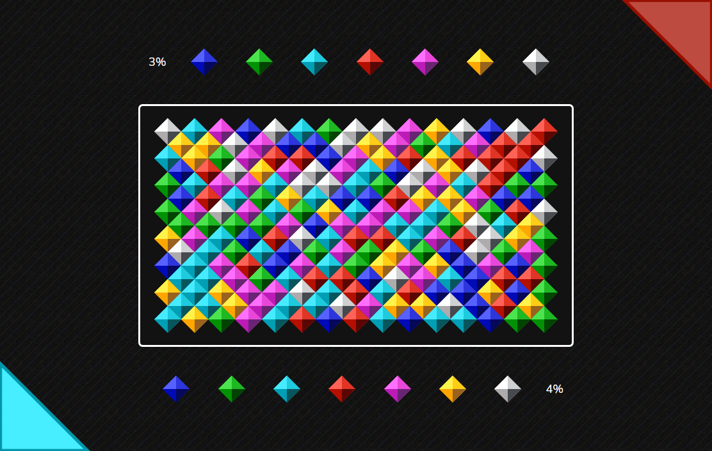

# Filler game

> Implementation of a turn-based strategic computer game [Filler](https://ru.wikipedia.org/wiki/Filler) for two players on the [Laravel framework](https://laravel.com/).



## Installation

Please check the official laravel installation guide for server requirements before you start. Official Documentation
Alternative installation is possible without local dependencies relying on Docker.

Clone the repository

```bash
git clone https://github.com/chamexxxx/filler.git
```

Switch to the repo folder

```bash
cd filler
```

Install all the dependencies using composer

```bash
composer install
```

Copy the example env file and make the required configuration changes in the .env file

```bash
cp .env.example .env
```

Generate a new application key

```bash
php artisan key:generate
```

Run the database migrations (Set the database connection in .env before migrating)

```bash
php artisan migrate
```

Start the local development server

```bash
php artisan serve
```

You can now access the server at http://localhost:8000
The api can be accessed at http://localhost:8000/api.

**TL;DR command list**

```bash
git clone https://github.com/chamexxxx/filler.git
cd filler
composer install
cp .env.example .env
php artisan key:generate
php artisan migrate
php artisan serve
```

**Make sure you set the correct database connection information in the .env file before running the migrations**

## Testing

You may use the **test** Artisan command to run tests

```bash
php artisan test
```

More details: [Laravel Testing](https://laravel.com/docs/8.x/testing)

## Docker

To run with [Docker](https://www.docker.com) follow these instructions:

Configure a Bash alias that allows you to execute Sail's commands

```bash
alias sail='bash vendor/bin/sail'
```

Create and start containers

```bash
sail up
```

Run the database migrations

```bash
sail artisan migrate
```

More details: [Laravel Sail](https://laravel.com/docs/8.x/sail)
